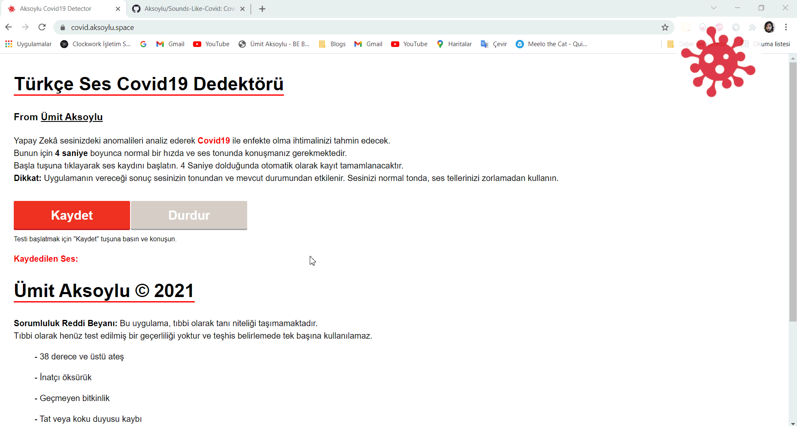
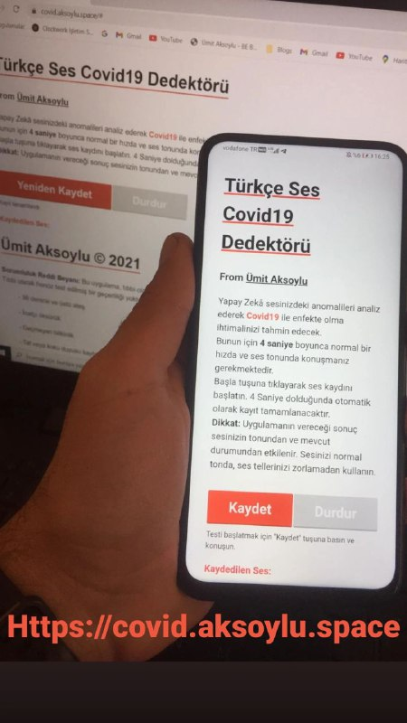

   
 You can try working demo on https://covid.aksoylu.space web address.  

                                                              
# Sounds-Like-Covid
Covid19 or another respiratory disease symptom detection from voice. 

Using Auto-Encoders and LSTM Networks.
                                                              
## Usage :
                                                         

  

### Source codes will be published soon
                                         
  
